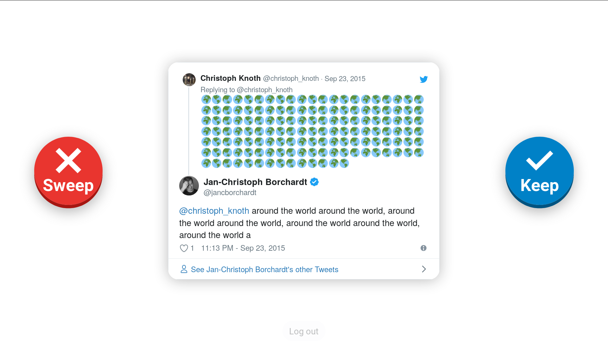

# 🐦🔀🗑️ Keep or Sweep for Twitter

Platforms like Twitter, Facebook and Instagram have your embarrassing old stuff that not even you know about anymore. Time to take a trip down memory lane and sweep it!

## 💬 Testimonials

> Every Nigerian politician needs this app so they can clean up their old lies.

– [@enobong](https://twitter.com/enobong), 129+ Sweeps

> I used this app and my cryptocoins are all still there.
>
> Trustworthy

– [@mradwanz](https://twitter.com/mradwanz), 21 Sweeps

> Ooh this is very empowering!
>
> Marie Kondo would be proud of this app

– [@saadcaffeine](https://twitter.com/saadcaffeine), 13 Sweeps

> `Insert testimonial here`

– [@myamy_vicy](https://twitter.com/myamy_vicy), 12 Sweeps

What do you think about Keep or Sweep? Let us know and include your Twitter username and Sweep score!

## 🏗 Setup
1. Register a [Twitter app](https://apps.twitter.com).
2. Set `http://localhost:8000/callback.php` as a "Callback URL" in the newly registered application.
3. Copy `.env.template` to `.env`.
4. In `.env`, set the `CONSUMER_KEY` and `CONSUMER_SECRET` from your Twitter app.
5. In a terminal, run `composer install` to install the dependencies.
6. Then run `./dev.sh` to start the server.
7. Visit [http://localhost:8000](http://localhost:8000) in a browser.

## 🔮 How it works

The Twitter API has a limit of 200 Tweets per request. So what we do:

1. We request the 200 latest Tweets of the user
2. Pick one random Tweet from those
3. Go back to step 1, but with the picked random Tweet as `max_id` so it goes further into the past

This is done in batches of 5: First 5 Tweets are delivered directly with page load, then when the page is loaded the next batch of 5 is fetched in the background. Then on every press of Keep or Sweep, another batch is loaded.

The next step for the algorithm is to just continuously save all the Tweet IDs for the requests and get them to the client-side, then pick from there.

## 🚦 Fixes and features

### 🐛 Issues happening often
- [ ] Embedded Tweets sometimes exceed viewport: Use max-height of embed or CSS to prevent overflow.
- [x] When you checked the "Really delete on sweep", using the space bar or the physical "Keep" button toggles the checkbox without noticing. → Fixed.
- [ ] Right now you need to consent via the checkbox "Really delete on sweep", unchecked by default in this early stage. Eventually we should remove that and just activate it.
- [x] "Log out" on the bottom or at the end only logs you out of the app, but not out of Twitter. → Now opens the Twitter log out page in a new tab.
- [ ] People don’t know their passwords. We could possibly have a fallback where you just put in your username, and swept Tweets are added onto a list you could mail to yourself at the end.
- [ ] Improve algorithm as described above, so it works well for people with few Tweets as well as many.

### 📑 Enhancements
- [ ] People in the audience have difficulty reading the Tweets: Needs a bigger screen for presentation, external monitor or even projector.
- [ ] Unclear when Tweets are Retweets: Needs a better indicator for Retweets.
- [ ] Sweeping could be more satisfying:
    - [ ] Show a Sweep counter for feedback, e.g. in or below the Sweep button.
    - [ ] Sound effects for spree sweeps (m-m-m-MONSTER SWEEP!) like in Quake.
- [ ] Sound effects not audible at crowded events: Need to be louder.
- [ ] Super like / Love: Additional button which retweets _and_ likes the Tweet, even if it is your own.
- [ ] Global high score table of sweep counter → maybe just Tweet from @keeporsweep with messages like "Yeah! @username swept 12 Tweets using http://keeporsweep.net 👏"

### 📜 Advanced stuff and details
- [ ] Fix callback denied page, just redirect to home again.
- [ ] Currently white screen when Twitter can’t be reached, instead show note about it (maybe also wifi is slow).
- [ ] Ability to undo last action would be nice. But in the case of sweeping we then need to hold off on actual deletion until the next action.
- [ ] The first batch of Tweets is hackily loaded via inserting invisible elements into the HTML first and getting the IDs from them via Javascript. This should be done properly.
- [ ] Reduce duplication in app.php and loadmore.php
- [ ] Possibly implement showing favorited Tweets too, with `favorites/list` and `favorites/destroy`. Needs additional indicator then.
- [ ] Could also display people you are following, to unfollow. However it’s a level above (kind of a "collection" and not a single element) and thus there’s less context there.
- [ ] Keep or Sweep x Wahl-o-mat: Show anonymized tweets of politicians, and show a result screen of parties you most agreed with.

## ❤ Thanks

Based on the great [TwitterOAuth PHP library](https://twitteroauth.com) and its demo site – thanks to [Abraham Williams](https://abrah.am)! 🎉

Using the official [Twitter embedded Tweets](https://developer.twitter.com/en/docs/twitter-for-websites/embedded-tweets/overview), so it shows conversation as well as count of replies & likes for context.
